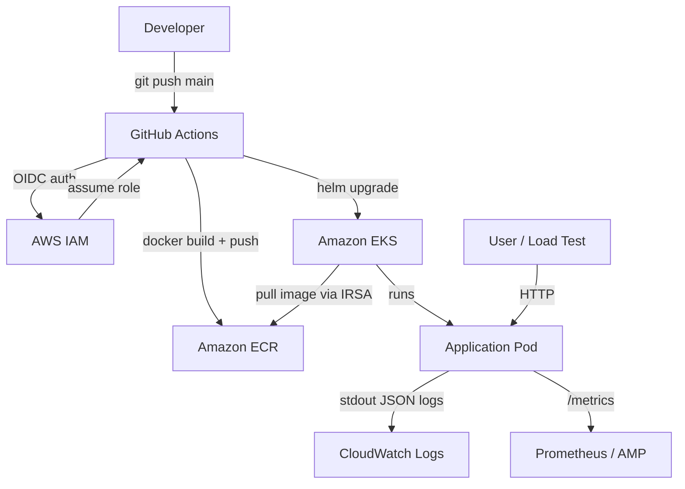
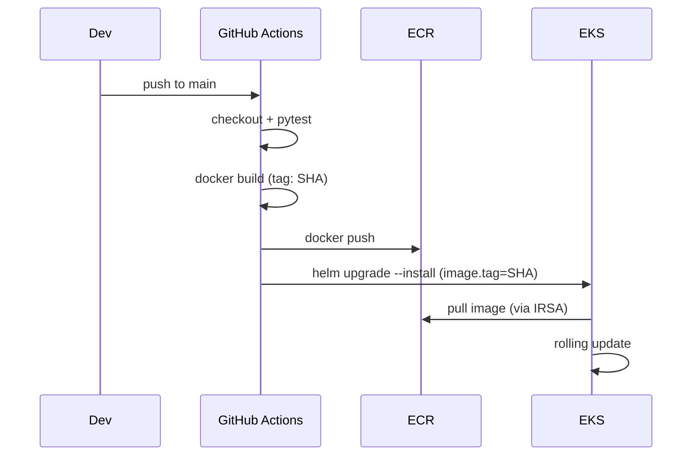
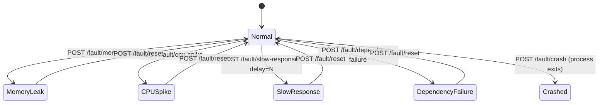

# Design Document

## Overview

This document describes the design for a simple HTTP web service built in Python, containerized with Docker, deployed to Amazon EKS via a GitHub Actions CI/CD pipeline using Helm, and instrumented with fault injection endpoints for DevOps troubleshooting practice.

The application is intentionally minimal — its primary purpose is to be a realistic, observable target for practicing EKS operations, not to implement business logic. The fault injection system is the most interesting part: it lets operators trigger real failure modes (OOMKill, CrashLoopBackOff, latency, unhealthy probes) on demand.

**Technology choices:**
- Language: Python 3.12 — wide ecosystem, excellent stdlib, easy to produce a slim container
- HTTP framework: FastAPI — async-capable, automatic request validation, minimal boilerplate
- ASGI server: Uvicorn — production-grade, supports graceful shutdown
- Container base: `python:3.12-slim` — minimal Debian-based image, no unnecessary packages
- Helm for Kubernetes packaging — standard, supports values overrides, works well with GitOps
- GitHub Actions with OIDC — no long-lived credentials, uses `aws-actions/configure-aws-credentials`
- Prometheus text format for `/metrics` — no external dependency, compatible with AWS Managed Prometheus
- Property-based testing: Hypothesis — mature Python PBT library with rich strategy support

---

## Architecture



### CI/CD Flow



### Fault Injection State Machine



---

## Components and Interfaces

### Project Layout

```
eks-github-cicd-app/
├── app/
│   ├── main.py          # FastAPI app factory, route registration, startup
│   ├── config.py        # Settings via pydantic-settings / env vars
│   ├── fault.py         # FaultController — central fault state manager
│   ├── logger.py        # Structured JSON logger setup
│   ├── metrics.py       # In-memory counters, Prometheus text serializer
│   └── middleware.py    # Request logging middleware
├── tests/
│   ├── test_handlers.py      # Unit tests (pytest + httpx AsyncClient)
│   ├── test_fault.py         # Unit tests for FaultController
│   ├── test_logger.py        # Unit tests for log output shape
│   ├── test_metrics.py       # Unit tests for metrics format
│   └── test_properties.py   # Property-based tests (Hypothesis)
├── helm/
│   └── eks-github-cicd-app/
│       ├── Chart.yaml
│       ├── values.yaml
│       └── templates/
│           ├── deployment.yaml
│           ├── service.yaml
│           └── serviceaccount.yaml
├── .github/
│   └── workflows/
│       ├── ci.yml       # PR: build + test only
│       └── cd.yml       # main push: build, push ECR, helm deploy
├── Dockerfile
└── requirements.txt
```

### Application Entry Point (`app/main.py`)

FastAPI app factory. Reads config, wires middleware, registers all routes, starts Uvicorn on the configured port.

**Environment variables:**

| Variable | Default | Description |
|---|---|---|
| `PORT` | `8080` | HTTP listen port |
| `APP_VERSION` | `dev` | Injected at build time via `--build-arg` / `ARG` |
| `CPU_SPIKE_DURATION` | `60` | Seconds for CPU spike fault |

### HTTP Routes (`app/main.py`)

All routes are registered on the FastAPI app instance. Each route delegates to the `FaultController` or `Metrics` singleton.

| Method | Path | Description |
|---|---|---|
| GET | `/` | Returns app name, version, timestamp |
| GET | `/health` | Returns healthy/unhealthy based on fault state |
| GET | `/metrics` | Prometheus text format metrics |
| POST | `/fault/memory-leak` | Activates memory leak fault |
| POST | `/fault/cpu-spike` | Activates CPU spike fault |
| GET | `/fault/slow-response` | Delays response by `?delay=N` ms |
| POST | `/fault/crash` | Exits process with code 1 |
| POST | `/fault/dependency-failure` | Marks health as unhealthy |
| POST | `/fault/reset` | Deactivates all faults |

All routes are wrapped by `RequestLoggingMiddleware` (Starlette middleware) that captures method, path, status code, latency, and request ID, then emits a structured JSON log line.

### Fault Controller (`app/fault.py`)

Central state manager for all active faults. Thread-safe via `threading.Lock` (Uvicorn runs in a single process with async handlers; the lock guards against concurrent async tasks and background threads used by memory-leak and cpu-spike).

```python
class FaultController:
    def __init__(self) -> None: ...

    def activate_memory_leak(self) -> None: ...
    def activate_cpu_spike(self, duration_sec: int) -> None: ...
    def activate_slow_response(self, delay_ms: int) -> None: ...
    def activate_dependency_failure(self) -> None: ...
    def reset(self) -> None: ...

    def is_healthy(self) -> bool: ...
    def slow_delay_ms(self) -> int: ...
    def active_faults(self) -> list[str]: ...
```

Memory leak is implemented by appending large byte arrays to a module-level list in a background thread. CPU spike runs a tight arithmetic loop in a `concurrent.futures.ThreadPoolExecutor` thread for the configured duration. Both are cancelled on `reset()` via a `threading.Event`.

### Logger (`app/logger.py`)

Configures Python's `logging` module with a custom `logging.Formatter` subclass that serializes each `LogRecord` to a single-line JSON string on stdout. Every log call includes `level`, `timestamp`, `message`. Request-scoped logs include `request_id` via a `contextvars.ContextVar`.

### Metrics (`app/metrics.py`)

In-memory counters using `threading.Lock`-protected integers. Exposes a `prometheus_text()` function that serializes to Prometheus text format.

```python
class Metrics:
    def increment_requests(self) -> None: ...
    def increment_errors(self) -> None: ...
    def prometheus_text(self, active_faults: list[str]) -> str: ...
```

---

## Data Models

### JSON Responses

**`GET /`**
```json
{
  "app": "eks-github-cicd-app",
  "version": "1.0.0",
  "timestamp": "2024-01-15T10:30:00Z"
}
```

**`GET /health` (normal)**
```json
{ "status": "healthy" }
```

**`GET /health` (dependency failure active)**
```json
{ "status": "unhealthy", "reason": "dependency unavailable" }
```

**`GET /fault/slow-response` (missing or invalid delay)**
```json
{ "error": "delay query parameter is required and must be a non-negative integer (milliseconds)" }
```

### Log Entry Schema

Every log line is a JSON object on a single line:

```json
{
  "level": "INFO",
  "timestamp": "2024-01-15T10:30:00.123Z",
  "message": "request completed",
  "request_id": "a1b2c3d4",
  "method": "GET",
  "path": "/health",
  "status": 200,
  "latency_ms": 1
}
```

Fault activation log:
```json
{
  "level": "WARNING",
  "timestamp": "2024-01-15T10:30:05.000Z",
  "message": "fault activated: memory-leak",
  "request_id": "e5f6g7h8"
}
```

### Prometheus Metrics Format

```
# HELP http_requests_total Total number of HTTP requests
# TYPE http_requests_total counter
http_requests_total 142

# HELP http_errors_total Total number of HTTP 5xx responses
# TYPE http_errors_total counter
http_errors_total 3

# HELP active_faults Number of currently active fault scenarios
# TYPE active_faults gauge
active_faults 1
```

### Helm `values.yaml` Schema

```yaml
replicaCount: 2

image:
  repository: 649976227195.dkr.ecr.us-east-1.amazonaws.com/eks-github-cicd-app
  tag: latest
  pullPolicy: IfNotPresent

service:
  type: ClusterIP
  port: 8080

resources:
  requests:
    cpu: "100m"
    memory: "128Mi"
  limits:
    cpu: "500m"
    memory: "256Mi"

livenessProbe:
  httpGet:
    path: /health
    port: 8080
  initialDelaySeconds: 5
  periodSeconds: 10

readinessProbe:
  httpGet:
    path: /health
    port: 8080
  initialDelaySeconds: 3
  periodSeconds: 5

serviceAccount:
  annotations:
    eks.amazonaws.com/role-arn: ""
```

---

## Correctness Properties

*A property is a characteristic or behavior that should hold true across all valid executions of a system — essentially, a formal statement about what the system should do. Properties serve as the bridge between human-readable specifications and machine-verifiable correctness guarantees.*

### Property 1: Root endpoint response shape

*For any* running server instance, a GET request to `/` should return HTTP 200 with a JSON body containing non-empty `app`, `version`, and `timestamp` fields.

**Validates: Requirements 1.2**

### Property 2: Configurable port binding

*For any* valid port number (1024–65535), when the server is started with that port configured, it should accept HTTP connections on exactly that port.

**Validates: Requirements 1.1**

### Property 3: Startup log contains port and version

*For any* server startup with a given port and version, the first log line emitted to stdout should be valid JSON containing the configured port and version values.

**Validates: Requirements 1.4**

### Property 4: Fault activation does not break server liveness

*For any* active fault from the set {memory-leak, cpu-spike, slow-response}, the server should continue to accept and respond to HTTP requests on `/health` with HTTP 200.

**Validates: Requirements 5.2, 6.2**

### Property 5: Fault activation produces a structured log warning

*For any* fault activation call (memory-leak, cpu-spike, slow-response, dependency-failure, crash), the fault controller should emit at least one log entry at WARNING level or above containing the fault name and relevant parameters.

**Validates: Requirements 5.4, 6.3, 7.4, 8.3**

### Property 6: Slow response respects delay parameter

*For any* non-negative integer delay value N (milliseconds), a GET to `/fault/slow-response?delay=N` should take at least N milliseconds to respond and return HTTP 200.

**Validates: Requirements 7.1, 7.2**

### Property 7: Invalid delay parameter returns HTTP 400

*For any* request to `/fault/slow-response` where the `delay` parameter is absent, empty, or non-numeric, the response should be HTTP 400 with a JSON body containing an `error` field.

**Validates: Requirements 7.3**

### Property 8: Dependency failure changes health status

*For any* server instance, after calling `/fault/dependency-failure`, the `/health` endpoint should return HTTP 503 with `{"status": "unhealthy", "reason": "dependency unavailable"}`.

**Validates: Requirements 9.1**

### Property 9: Reset restores healthy state

*For any* combination of active faults, calling `/fault/reset` should deactivate all faults such that the subsequent call to `/health` returns HTTP 200 with `{"status": "healthy"}`.

**Validates: Requirements 9.3, 9.4**

### Property 10: All log entries are valid structured JSON with required fields

*For any* HTTP request handled by the server, the corresponding log entry emitted to stdout should be valid JSON containing at minimum the fields `level`, `timestamp`, `message`, and `request_id`, plus `method`, `path`, `status`, and `latency_ms`.

**Validates: Requirements 10.1, 10.2, 10.4**

### Property 11: Metrics endpoint contains required metric names

*For any* server instance that has handled at least one request, a GET to `/metrics` should return a response body containing the metric names `http_requests_total`, `http_errors_total`, and `active_faults` in Prometheus text format.

**Validates: Requirements 10.3**

### Property 12: Helm chart values are reflected in rendered output

*For any* valid `values.yaml` override specifying `replicaCount`, `image.tag`, or resource limits, the rendered Helm chart manifests should contain those exact values in the corresponding Kubernetes resource fields.

**Validates: Requirements 4.1, 4.4, 4.6**

---

## Error Handling

### Port already in use (Requirement 1.5)

On startup, Uvicorn's socket binding raises `OSError` with `errno.EADDRINUSE` if the port is taken. The startup code catches this, logs a structured JSON error message to stdout, and calls `sys.exit(1)`. No request handlers are registered before this check.

### Invalid fault parameters (Requirement 7.3)

The `/fault/slow-response` handler reads the `delay` query parameter as a string and attempts `int(delay)`. If the parameter is absent or raises `ValueError`, the handler returns HTTP 400 with a JSON error body immediately, without mutating any fault state.

### Concurrent fault activation

`FaultController` uses a `threading.Lock` for all state reads and writes. Concurrent calls to activate different faults are safe. Calling `reset()` while a memory-leak or cpu-spike background thread is running sets a `threading.Event` that the thread checks on each iteration, causing it to exit cleanly.

### Graceful shutdown

Uvicorn handles `SIGTERM`/`SIGINT` and drains in-flight requests before exit (configurable via `--timeout-graceful-shutdown`). The crash fault bypasses this and calls `os._exit(1)` directly to ensure immediate termination without running cleanup handlers.

### Unknown routes

FastAPI returns HTTP 404 for unregistered paths. The `RequestLoggingMiddleware` still captures and logs these requests.

---

## Testing Strategy

### Unit Tests

Unit tests use `pytest` with `httpx.AsyncClient` (via `anyio`) to exercise handlers without a live server. They cover specific examples, edge cases, and error conditions.

- `test_handlers.py`: Test each route in isolation. Cover happy paths and error cases (e.g., missing `delay` → 400, `/health` after dependency-failure → 503, `/health` after reset → 200).
- `test_fault.py`: Test `FaultController` state transitions directly. Verify `is_healthy()` returns `False` after `activate_dependency_failure()`, `True` after `reset()`. Verify `active_faults()` returns the correct list.
- `test_logger.py`: Capture stdout with `capsys` and verify log lines are valid JSON with required fields.
- `test_metrics.py`: Verify counter increments and Prometheus text output format.

### Property-Based Tests

Property-based tests use [Hypothesis](https://hypothesis.readthedocs.io/) (Python PBT library). Each test is decorated with `@settings(max_examples=100)` to run a minimum of 100 iterations.

Each test is tagged with a comment in the format:
`# Feature: eks-github-cicd-app, Property N: <property text>`

**Property tests to implement:**

| Test | Property | Hypothesis Strategy |
|---|---|---|
| `test_root_response_shape` | Property 1 | `st.text(min_size=1)` for app/version strings |
| `test_configurable_port` | Property 2 | `st.integers(min_value=1024, max_value=65535)` |
| `test_startup_log_fields` | Property 3 | `st.integers(1024, 65535)`, `st.text(min_size=1)` for version |
| `test_fault_does_not_break_liveness` | Property 4 | `st.sampled_from(["memory-leak", "cpu-spike", "slow-response"])` |
| `test_fault_activation_logs_warning` | Property 5 | `st.sampled_from(["memory-leak", "cpu-spike", "slow-response", "dependency-failure"])` |
| `test_slow_response_delay` | Property 6 | `st.integers(min_value=0, max_value=200)` (ms) |
| `test_invalid_delay_returns_400` | Property 7 | `st.text().filter(lambda s: not s.lstrip('-').isdigit())` |
| `test_dependency_failure_health` | Property 8 | No generator needed (state test) |
| `test_reset_restores_health` | Property 9 | `st.lists(st.sampled_from(["memory-leak", "cpu-spike", "slow-response", "dependency-failure"]))` |
| `test_log_entry_fields` | Property 10 | `st.sampled_from(["GET", "POST"])`, `st.text(min_size=1, alphabet=st.characters(whitelist_categories=("Lu", "Ll", "Nd")))` |
| `test_metrics_contains_required_names` | Property 11 | `st.integers(min_value=1, max_value=1000)` for request counts |
| `test_helm_values_reflected` | Property 12 | `st.integers(min_value=1, max_value=10)` for replicas, `st.text(min_size=1)` for image tags |

### Integration Tests

A `pytest` marker `@pytest.mark.integration` starts a real Uvicorn server on a random port using `anyio` and exercises the full request/response cycle including the logging middleware. Run with `pytest -m integration`.

### Helm Chart Tests

Use `helm template` + `helm lint` in CI to render the chart with various `--set` overrides and pipe output through `yq` assertions. This validates Property 12 without requiring a live cluster.
